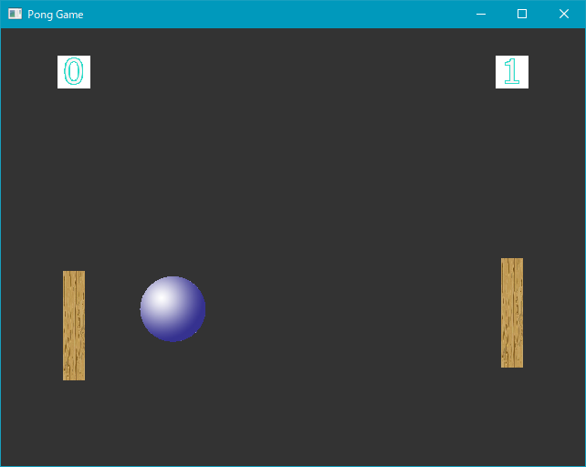

# GLFWTest
This is Pong Game developed with OpenGL.

## Setup
1. Open GLFWTest.sln with Visual Studio 2015 or later.
2. Build and run.

## Dependencies
This project has dependencies described below, but these are included in the project, so you don't need to acquire them manually.

* GLFW 3.2.1
* glad

## License
MIT.
